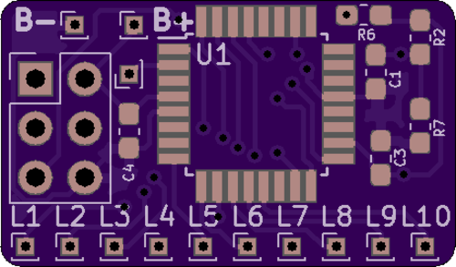
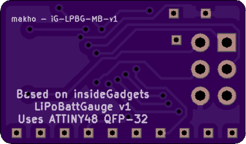
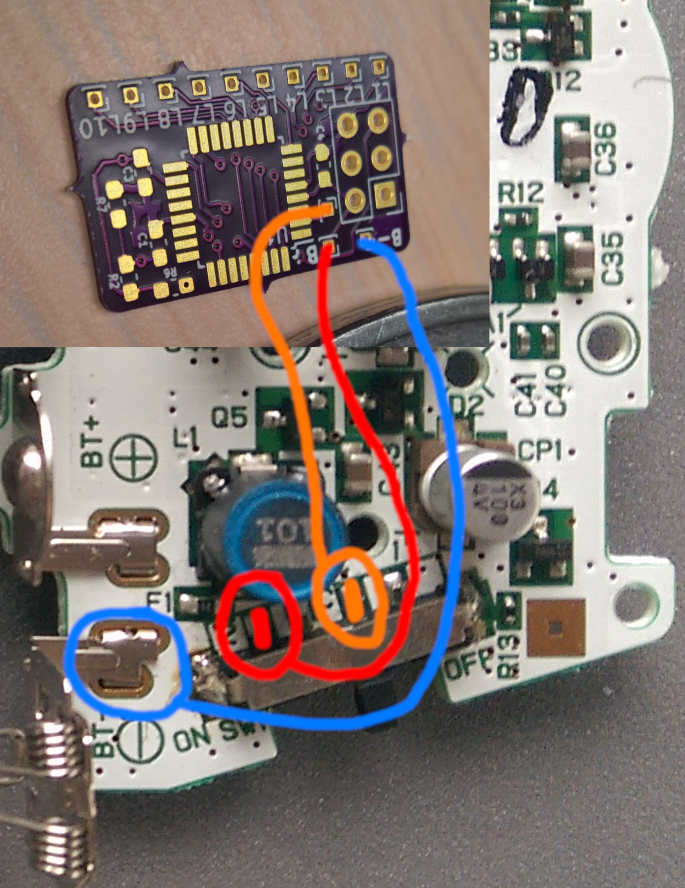

# iG-LiPo-Battery-Gauge
Modified version of https://github.com/insidegadgets/LiPo-Battery-Gauge

I made this because I accidentally ordered the wrong ATTINYs and it was cheaper to make new custom PCBs than to order the correct MCUs. I also tweaked the LED board that Alex uploaded to comply with OSHpark's minimum size requirements. 

## LED Board

I've uploaded the tweaked EAGLE BRD file and uploaded the exported gerbers if you want to use a different manufacturer. This PCB fits nicely in a GBA right below the LCD. See [my youtube video](https://www.youtube.com/watch?v=7A705K_WF-E) for more info on the install and usage.

[Order the LED board here](https://oshpark.com/shared_projects/lczB1jHZ)

## Main Board

I recreated the original main board for use with a different size ATTINY. This is functionally identical to Alex's board and other than the ATTINY, it uses the exact same parts. You can also solder resistors and LEDs straight to this board but I think some tweaks to this board would make that a lot easier. 
[Order the LED board here](https://oshpark.com/shared_projects/lczB1jHZ)

## BOM

The BOM (Bill of Materials) is inside the EAGLE schematic files for the original PCBs ([see the linked repo](https://github.com/insidegadgets/LiPo-Battery-Gauge)) but I'll sum everything up for you: 

LED Board
* 10x 10k SMT 0805 resistors (or 0603, both fit fine)
* 10x 1206 SMT LEDs in whatever color you want

Main Board -- all resistor and capacitor pads are sized for 0603 components but are slightly oversized for hand soldering and will take a 0805 component on a whim. 
* 3x 0603 0.1uF capacitors
* 1x 10K 0603 resistor (R6)
* 1x 320K 0603 resistor (R7) (though the firmware I uploaded is for if you use a 300k resistor instead)
* 1x 1M 0603 resistor (R2)
* 1x ATTINY48 VQFN-28 package for Alex's board or QFP-32 for my board 

## Firmware 

The firmware in this repo is for if you use a 300k resistor instead of a 320k resistor. Otherwise, your gauge will estimate incorrectly. I have also tweaked the firmware to change the scale so that nearly full charge illumunates all 10 LEDs and nearly empty charge disabled all 10 LEDs. It should scale somewhat linearly but battery voltage curves can be weird. 

Editing the firmware? Good luck. I added comments for the SP version of the firmware regarding the values I tweaked. I did not do the same for the GBA version as I didn't intend on sharing it. My bad. I used ubuntu for editing and recompiling. I've also already tweaked the makefiles so once you have all the dependencies, you'll just need to run make and take the .hex file and flash that to your ATTINY with avrdude. If compiling with Windows, you'll have to edit the makefile to include the location of the binaries or just add all the binaries to your PATH file. 

As far as flashing the firmware goes, I used avrdude, a USBasp, and Windows for that. I used zadig to install the libusb-win32 driver for my USBasp instead of the default one Windows installs. Otherwise, avrdude won't recognize the USBasp. Once setup, you'll need to download avrdude and the main.hex file from the insideGadgets repo or my repo and run the following command: .\avrdude.exe -c usbasp -p attiny48 -u -U flash:w:main.hex and you'll probably have to add some lines to your avrdude.conf file just to get it flash an attiny48. This worked for me: https://lists.nongnu.org/archive/html/avrdude-dev/2009-08/msg00005.html

I've also attached my avrdude.conf file for reference. It needs to be in the same directory as avrdude to work. 

## Installation

Assemble the boards, flash the firmware, TEST FIT your preferred location, then stick both boards down. You'll have to connect the LED board to the main board with 11 wires (10 LED, 1 common ground). I know this sounds obvious, but don't forget to account for the thickness of wire. 30 AWG solid core works fine for this though thinner might be better. Sorry for the vague instructions but connecting the two boards is a subjective process. My video linked earlier shows how I did it.

You'll also need to connect the main board to the Game Boy with three wires. B- goes either directly on the negative battery terminal or the system ground. If there is a diode between your battery and the GBA on the battery terminal, the wire needs to go directly to the battery or the voltage will not measure correctly. B+ goes directly on the positive battery terminal though you can also connect it directly to the system fuse instead to protect the input of the gauge board if your diode is on the ground side. Lastly, the reference wire needs to be connected to the system power so that it is powered only when the system is on. The best spot is one of the two common pins on the power switch. Please see the diagram below for one such method of wiring up this board.

(base image from https://gbhwdb.gekkio.fi/consoles/agb/)

Keep in mind that there is no diode on this diagram. The B+ or B- wire **must** go on the battery side of the diode. 
